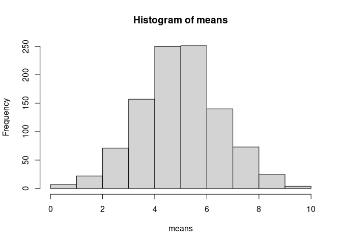

HW 1
================

### Question 1

#### 1.1

,
and

so the budget constraint is:


#### 1.12

The MRS is:


MRS =


Set MRS equal to the price ratio


Which gives:

X = 1/1.1 = 0.91

Plug that into the budget constraint:

100 = 1.1\*(1/1.1) + Y 100 = 1 + Y Y = 99

So the consumer will buy 99 of Y and 0.91 of X.

#### 1.13

The quasi-linear utility function is good when good Y is money because Y
does not have diminishing marginal returns (in classical models). The
partial derivative with respect to y is 1, so no matter how much money
you have, getting an additional dollar provides the same utility. Good X
does have diminishing marginal returns. The partial derivative with
respect to X is 1/X, so when you have more X to start with, getting an
additional X does not give you as much utility as when you start with
only a few X. This is what we expect of goods. Getting a 50th gallon of
milk does not bring me any utility at all while getting the second one
gives me a lot.

#### 1.21

I know the answer here is the same as the last part, but I will solve it
with the Lagrangian method for fun ().

 + y + \lambda(100 - 1.1x -y)")


= 0

= 0


Solving this gives


#### 1.22

Plugging these values into the utility function gives:

U(x,y,c) = ln(0.91) + 99 - v U = 98.905 - v

#### 1.23

The MRS is still

MRS = 1/X

Set that equal to the price ratio

1/X = 1/1 1/X = 1 X = 1

Plug that into the budget constraint

100 = 1.1X + Y 100 = 1.1 + Y Y = 98.9

So the consumer buys 1 of X and 98.9 of Y this time.

Their utility is

U = ln(1) + 98.9 U = 98.9

#### 1.24

If it is optimal to pay attention to taxes, the consumer will have
higher utility from part 1.22 than in 1.23

98.905 - v \> 98.9 -v \> -.0047 v \< 0.0047

So, if v is less than .0047, it is optimal to pay attention to taxes

#### 1.3

Both the store and the consumer pay for the sales tax. The store pays
because the consumer buys less of X than they would if there was no
sales tax. The consumer pays because they have to lose utility by paying
attention to the sales tax, and buy less of the items than they would
without it.

### Question 3

#### 3.1

``` r
# Set seed so my answers won't change when I knit this

set.seed(5645)

# Draw random variables

vars <- rnorm(10, 5, 5)
```

#### 3.2

``` r
# Get the mean of vars

mean(vars)
```

    ## [1] 7.606588

The mean of my 10 random variables is significantly higher than the true
mean. It is 2.5 bigger than the true mean of 10.

#### 3.3

``` r
# Calculate SE

sdev <- sd(vars)

serror <- sdev / sqrt(10); serror
```

    ## [1] 1.792275

The standard error is 1.8.

#### 3.4

``` r
# Set seed again because its not staying the same

set.seed(5645)

# Run the same thing 1000 times

means <- sapply(1:1000, function(x){
  mean(rnorm(10,5,5))
}) 

hist(means)
```

<!-- -->

#### 3.5

``` r
# Get standard deviation 

sd(means)
```

    ## [1] 1.547885

The standard deviation is 1.5.

#### 3.6

The standard is smaller than it is in part 3. This is expected because
as we run the simulation more times, the outcomes should be less noisy,
which corresponds to a smaller standard error.

S
